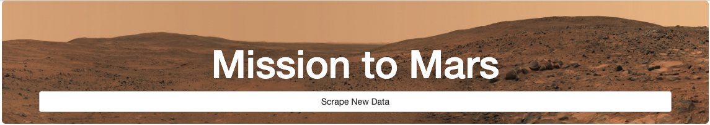
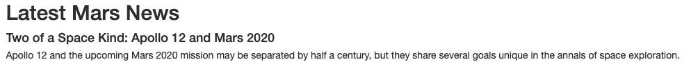
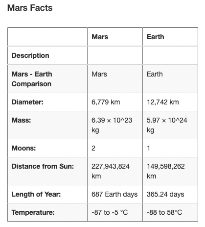
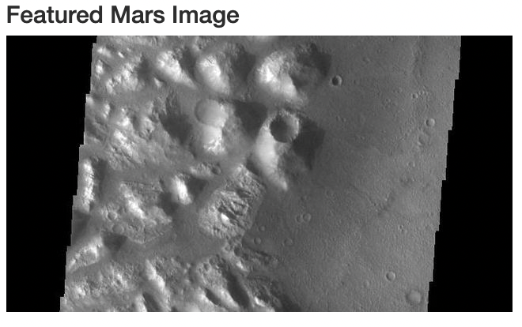
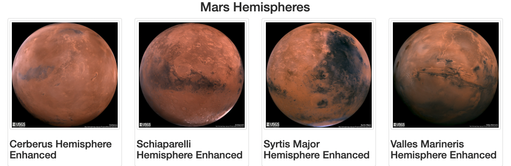
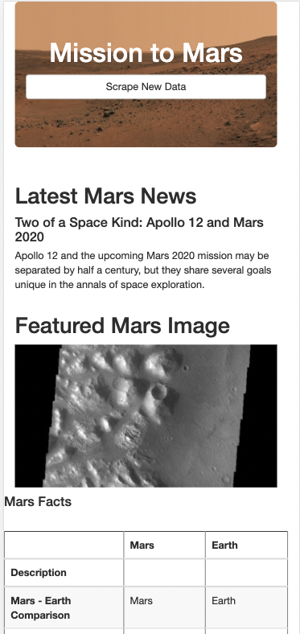
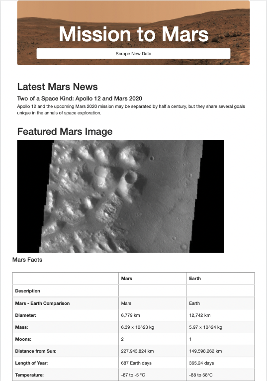

# Mission to Mars

## Overview
---
This project aimed to create an interactive website that would, on demand, scrape various online sources to compile the latest data related to Mars. The following technologies/coding-languages were utilized:

- BeautifulSoup
- Splinter
- Python
- Flask
- MongoDB
- Bootstrap
- HTML

The project consisted of the following objectives:

1. Scrape the latest Mars-related headline from `redplanetscience.com`
2. Scrape the latest full-resolution image of Mars from `spaceimages-mars.com`
3. Scrape a collection of Mars facts from `galaxyfacts-mars.com`
4. Scrape full-resolution images of the Mars hemispheres from `marshemispheres.com`
5. Organize a clean and responsive layout of all the aformentioned data
6. Create a flask app with live scraping capabilities to enable an on-demand scrape of the aforementioned data upon the click of a button

## Elements:
---
### Header and Scrape Button

### Latest News

### Mars Facts

### Featured Mars Image

### Mars Hemispheres

## Responsive Design
---
Bootstrap provided a framework enabling a responsible website structure. The following screenshots demonstrate the results:

### iPhone 12

### iPad Air
